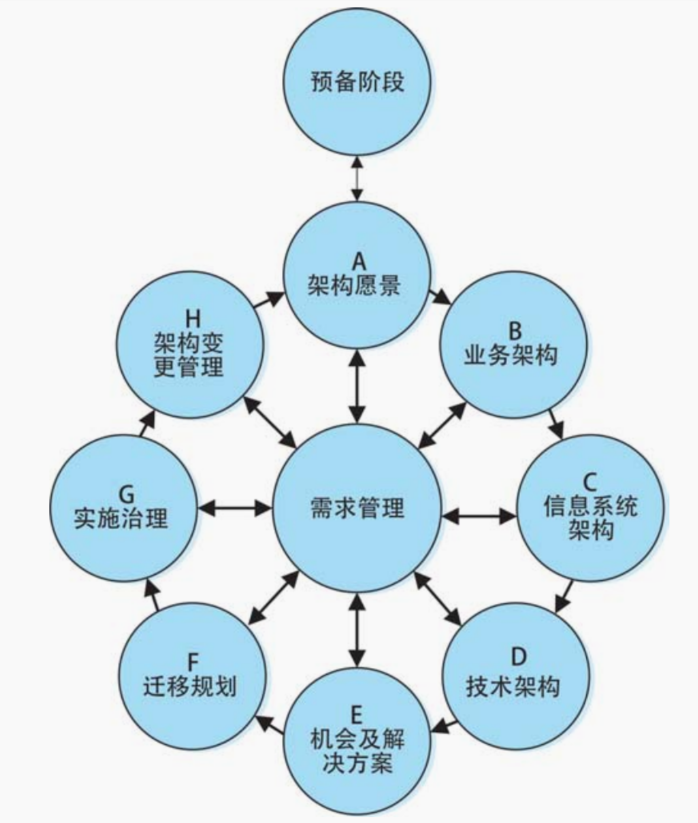

ADM架构开发方法。

ADM在完成预备阶段后，会进入8个环节构成的循环中。需要注意的是，在每一个环节，我们都需要进行需求管理。

准备阶段。为实施成功的企业架构项目做好组织、工具、方法等方面的工具（利益相关者、架构团队、架构原则、架构工具等等）。

阶段A——架构愿景。远景：我们的工作范围是什么、有什么约束、大家的期望是什么？重点是：大家一致认可。

阶段B——业务架构。[把业务架构搞搞懂，才算敲开了理解业务的大门！](https://zhuanlan.zhihu.com/p/719167334)

阶段C——信息系统架构。确定主要的信息类型和处理这些信息的应用系统。

阶段D——技术架构。完成系统基础服务设施的设计（物理实现，包括硬件、软件和通信技术）。

阶段E——机会及解决方案。确定目标架构交付物。  

阶段F——迁移规划。做好从基线架构（目前的架构）向目标架构迁移的实施计划。

阶段G——实施治理。确保架构的迁移，始终与计划保持一致。

阶段H——结构变更管理。管理架构的改变，使之可控。  

需求管理。完成对奇特需求的识别、存储并把它们插入相应的ADM阶段。