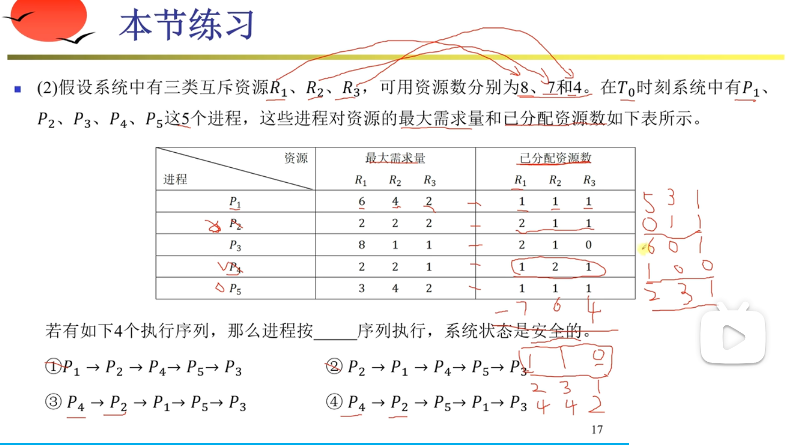

计算机软件指的是，计算机系统中的程序及其文档。

计算机软件可以分为系统软件和应用软件两大类。

操作系统，是一组程序，负责对计算机的软件资源和硬件资源实施管理。操作系统通过CPU管理、存储管理、设备管理和文件管理对各类资源进行合理分配、尽可能提升计算机的生产力。

操作系统的内核负责直接操作硬件，并为其他软件提供统一的、易于使用的接口。

操作系统的类型：批处理系统、分时操作系统、实时操作系统、网络操作系统、分布式操作系统、微型计算机操作系统、嵌入式操作系统。

**操作系统对IO设备的管理中，经常针对CPU和IO设备的处理速度差异，采用缓冲技术来实现二者的协调（让二者形成异步处理系统）**。比如数据从“IO到缓冲区到处理器”任务，可以设置多个缓冲区，提升数据传输效率（考试一般给的场景是2个缓冲区）。  
单缓冲区的情况下，处理K分数据的耗时等于K(IO到缓冲区+缓冲区到cpu)+cpu处理数据。注意，IO到缓冲区的环节，和缓冲区到cpu的环节，是串行；第k份数据从“缓冲区到cp”的环节未完成时，第k+1份数据从IO到缓冲区的环节就不能开始。  
双缓冲区的情况下，处理K分数据的耗时等于K*IO到缓冲区+缓冲区到cpu++cpu处理数据。注意，一般来说“IO到缓冲区”的耗时，大于“缓冲区到cpu”的耗时，且cpu处理速度非常快；“IO到缓冲区”的耗时内，足够完成后续2个环节；在向双缓冲区写数据的同时，下游环节非常快地完成了数据的传输和处理（等待缓冲区过来的数据）。总的来说，双缓冲区仍然是瓶颈。

在内存管理中，操作系统经常采用**分页存储管理**方式，简化操作、提升性能。具体来说，就是将地址空间划分为若干个大小相等的区域，即页。主存（物理地址）也划分大小相同的若干个物理块，即块。  
分页地址的结构：页号+页内地址。页内地址也叫做页内偏移量。通常我们会使用如下的形式表示分页地址结构：  

注意，页号两侧的数字，分别表示页号左侧和右侧对应的位数。在这个例子中，页号有(31-12)+1=20位。页内偏移量有12位，也就是4k。  
通常试题会要求我们基于页号-物理块映射表，计算物理地址。考试的时候，一般会给出页号和页内偏移量的位数，然后让你计算页的大小。地址可能是2进制、8进制、10进制或16进制，需要进行一定的换算。  
试题可能会要求我们为进程分配块或者页。；一般的操作系统的页面置换算法，倾向于执行此前执行过的进程。

还有一种存储管理方法：分段管理。分段管理的特点是，每个段都有自己的段号，每个段的大小可以不同。段号和段内地址一起，可以定位到具体的物理地址。
分段地址的结构：段号+段内地址。

进程们在使用资源的时候可能遇到**死锁**。死锁是指多个进程因争夺资源而造成的一种互相等待的现象。为了避免死锁，操作系统通常需要采用死锁避免策略。死锁避免策略一般包括：预防死锁、避免死锁、检测死锁、解除死锁。  
试题可能要求我们给出几个进程避免死锁的执行过程或方法。可以使用银行家算法。此时要注意，执行完一个进程后，对应的资源就释放了。  
如下图所示，**银行家算法**的执行过程是这样的（一般试题会给出各个进程的最大资源需求量和已占有的资源量，要求我们给出安全的执行序列）：首先计算资源余量；然后寻找资源余量支持执行的进程，执行该进程；然后释放该进程占用的资源；然后重复上述过程，直到所有进程都执行完毕。  

数据库。
关系数据库。
分布式数据库。
数据库管理系统。 Oracle/MySQL等。

文件系统。  
文件是具有符号名的、在逻辑上具有完整意义的一组相关信息项的集合。文件系统是造作系统中实现文件统一管理的一组软件和相关数据的集合。    
文件类型。分类的维度比较多。  
文件的结构和组织。文件的结构包括逻辑结构和物理结构。  
文件存取的方法和存储空间的管理。  
文件共享和保护。

网络协议。两个计算机设备约定的通信数据格式、数据传送时序以及相应的控制信息和应答信号等。

中间件。应用软件与各类操作系统之间的标准化编程接口和协议。
中间件分类：通信处理中间件、事务处理中间件、数据存取管理中间件、web服务器中间件、安全中间件、跨平台和架构的中间件、专用平台中间件、网络中间件。

软件构件。软件构件，不论是自己开发的还是购买的，可以用来提升软件开发过程中的代码复用率，进而提升开发效率。

应用软件。

嵌入式系统及软件。
嵌入式系统的组成：嵌入式处理器、相关支撑硬件、嵌入式操作系统、支撑软件、应用软件。  

计算机网络。
计算机网络是利用通信线路将若干地理上分散、功能上独立的计算机系统和通信设备以恰当的形式连接起来，并依靠网络软件及通信协议实现资源共享和信息传递的系统。 
计算机网络的功能：  
（1）数据通信。    
（2）资源共享。    
（3）管理集中化。  
（4）实现分布式处理。  
（5）负荷均衡。  

网络相关的性能指标：  
（1）速率。  
（2）带宽。  
（3）吞吐量。  
（4）时延。由发送时延、传播时延、处理时延、排队时延。  
（5）往返时间。  
（6）利用率。

网络的非性能指标：  
（1）费用。  
（2）质量。  
（3）标准化。  
（4）可靠性。  
（5）可扩展性和可升级性。  
（6）易管理和维护性。

通信技术。  
计算机网络通过信道来传递数据（模拟信号和数字信号）。  
信道分为物理信道和逻辑信道。物理信道指的是光电信号传输的实际方式，按照截止类型分为有线信道和无线信道。逻辑信道是为了便于理解和优化网络设计方案而虚拟出来的一种通信线路。逻辑信道可以是有连接的和无连接的。  

信道。信息传输过程，是由信源、发信机、信道、收信机、信宿共同完成的。
信号变换。
复用技术和多址技术。
5G通信网络。

网络技术。  
局域网。局域网的网络拓扑：形状结构，树状结构，总线结构，环形结构。  
以太网技术。以太网帧的结构（目的终端的MAC地址，源MAC地址，数据帧类型/数据帧长度，具体数据，帧校验字段）。最小帧长（保证源终端在将数据发送完成之前，目的终端已经收到数据，从而保证其他阶段不会误判线路空闲）。最大传输距离。流量控制。
无线局域网。  
广域网。广域网相关技术：同步光网络，数字数据网，帧中继，异步传输技术。   
广域网的特点：  
（1）主要面向数据通信，支持用户使用计算机进行远距离信息交换。  
（2）覆盖范围广，支持远距离的通信，拓扑结构不固定。  
（3）由电信部门负责建设和管理，并向全社会提供有偿的通信服务。  
广域网的分类：公共传输网络（移动、电信等运营商提供的网络）；专用传输网络（公司局域网）；无线传输网络（传输介质维度）。  
域域网是一种覆盖城市或大型园区的计算机网络，规模介于局域网和广域网。

移动通信网。
从1G刀片5G的发展史。
5G网络。网络切片技术允许在同一套物理设备上提供不同性能特点的网络服务，降低了健忘和运维成本。

组网技术。  
网络设备及其工作层级。基本的网络设备：中继器，集线器，网桥，交换机，路由器，防火墙。[图解网络：组建一个网络需要用到哪些设备？](https://zhuanlan.zhihu.com/p/705916704)。从中继器到路由器，通信支持能力越来越强。  
网络协议。开放系统互联模型（主要指OSI网络体系结构）。OSI协议集和TCP/IP协议集可能比较重要。  
交换技术。  
路由技术。

网络工程的三个环节：
（1）网络规划。
（2）网络设计。
（3）网络实施。

