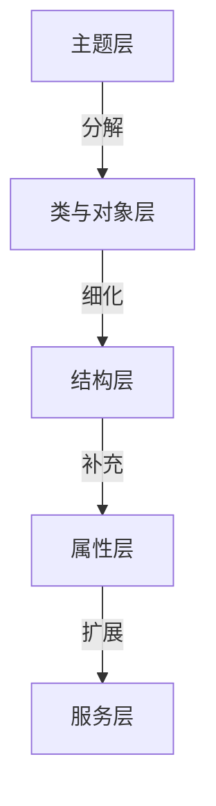

### **面向对象分析（OOA）的5个层次详解与应用指南by deepseek**

面向对象分析（Object-Oriented Analysis, OOA）通过分层抽象将现实问题转化为软件模型。以下是5个核心层次的理解框架和实际应用方法：

---

#### **1. 主题层（Subject Layer）**
**作用**：宏观视角的系统模块划分，解决复杂系统的认知负荷问题。  
**理解要点**：  
- 将系统分解为多个**主题（子系统）**，每个主题代表一个高内聚的功能域  
- 类似书籍的"章节划分"，帮助人类理解大规模系统  

**应用方法**：  
1. 识别核心功能领域（如电商系统的"订单"、"支付"、"库存"主题）  
2. 用**包图（Package Diagram）**描述主题关系：  
   ```mermaid
   graph LR
       A[电商系统] --> B[订单主题]
       A --> C[支付主题]
       A --> D[库存主题]
   ```  
3. 控制主题数量（5±2个，遵循米勒定律）

**案例**：  
- 医院管理系统主题划分：门诊、住院、药房、财务、HR  

---

#### **2. 类与对象层（Class & Object Layer）**
**作用**：识别系统中的实体及其静态关系。  
**理解要点**：  
- **对象** = 属性（数据） + 行为（方法）  
- **类**是对象的抽象模板  

**应用方法**：  
1. 通过**名词分析法**识别候选类（如"患者"、"处方"、"药品"）  
2. 用**UML类图**描述：  
   ```plantuml
   class Patient {
     -id: String
     -name: String
     +register()
   }
   class Prescription {
     -drugs: List<Drug>
     +addDrug()
   }
   Patient "1" --> "0..*" Prescription
   ```  
3. 应用**SOLID原则**评估类设计  

**常见错误**：  
- 混淆属性与类（如将"患者年龄"作为类而非属性）  
- 贫血模型（类仅有getter/setter，无行为）  

---

#### **3. 结构层（Structure Layer）**
**作用**：定义类/对象间的静态关系，构建系统骨架。  
**关键关系类型**：  
| 关系类型       | UML表示        | 示例                          |  
|----------------|----------------|-------------------------------|  
| **泛化**       | ◁─┐           | 医生 → 外科医生（继承）        |  
| **关联**       | ─────         | 医生-患者（诊疗关系）          |  
| **聚合**       | ◇───          | 科室-医生（整体与部分）        |  
| **组合**       | ◆───          | 医院-急诊室（强生命周期绑定）  |  

**应用技巧**：  
- 优先使用组合而非继承（组合复用原则）  
- 双向关联需谨慎（易导致循环依赖）  

---

#### **4. 属性层（Attribute Layer）**
**作用**：精确定义类的数据特征。  
**设计步骤**：  
1. 识别必要属性（如`Patient.name`）  
2. 指定数据类型和约束：  
   ```java
   public class Patient {
       @NotBlank 
       private String name;  // 非空约束
       
       @Range(min=0, max=150)
       private int age;      // 值域约束
   }
   ```  
3. 区分：  
   - **原生属性**（如age）  
   - **派生属性**（如age可由birthDate计算）  

**最佳实践**：  
- 避免暴露可变属性（使用private+getter）  
- 用**值对象**替代基本类型（如`PhoneNumber`类代替String）  

---

#### **5. 服务层（Service Layer）**
**作用**：定义对象的行为和系统功能。  
**分析方法**：  
1. 通过**动词分析**识别操作（如"开具处方"、"结算费用"）  
2. 使用**UML状态图**描述行为：  
   ```mermaid
   stateDiagram
       [*] --> 未支付
       未支付 --> 已支付: 支付()
       已支付 --> 已发货: 发货()
       已发货 --> 已完成: 确认收货()
   ```  
3. 区分：  
   - **基本操作**（如`Patient.changeAddress()`）  
   - **系统级服务**（如`MedicalRecordService.merge()`）  

**设计原则**：  
- 遵循**命令-查询分离**（CQS）  
- 保持方法**单一职责**  

---

### **五层次协同应用案例：在线教育系统**
1. **主题层**：课程管理、用户中心、支付系统  
2. **类与对象**：`Course`、`Teacher`、`Student`  
3. **结构层**：`Teacher`与`Course`是1对多关联  
4. **属性层**：  
   ```python
   class Course:
       def __init__(self, title: str, price: Decimal):
           self.__title = title  # 私有属性
           self.__price = price
   ```  
5. **服务层**：  
   ```java
   public interface EnrollmentService {
       EnrollmentResult enroll(Student s, Course c); // 核心服务
   }
   ```

---

### **层次间的演进关系**


---

### **常见误区与验证方法**
1. **主题层过度分解**：  
   - 检查：每个主题是否对应明确的业务领域？  
   - 修复：合并相关性强的主题（如"用户认证"并入"用户中心"）  

2. **贫血模型**：  
   - 检查：类是否只有getter/setter？  
   - 修复：将相关业务逻辑移入类（如`Order.calculateTotal()`）  

3. **关系滥用**：  
   - 检查：是否用继承实现代码复用而非语义泛化？  
   - 修复：改用组合或接口  

---

### **现代OOA增强实践**
1. **领域驱动设计（DDD）整合**：  
   - 主题层 → 限界上下文  
   - 服务层 → 领域服务  

2. **C4模型扩展**：  
   ```mermaid
   graph TD
       主题层 --> Context
       类与对象层 --> Container
       结构层 --> Component
   ```

通过分层分析，OOA能系统化地降低复杂性，构建符合现实语义的软件模型。实际应用中建议结合**用例驱动**，确保每个层次的分析都源自真实业务需求。