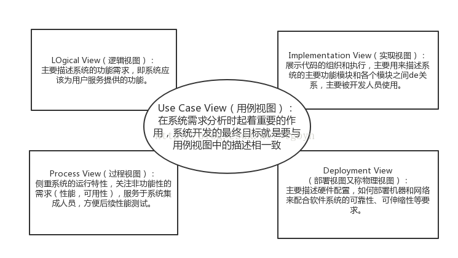
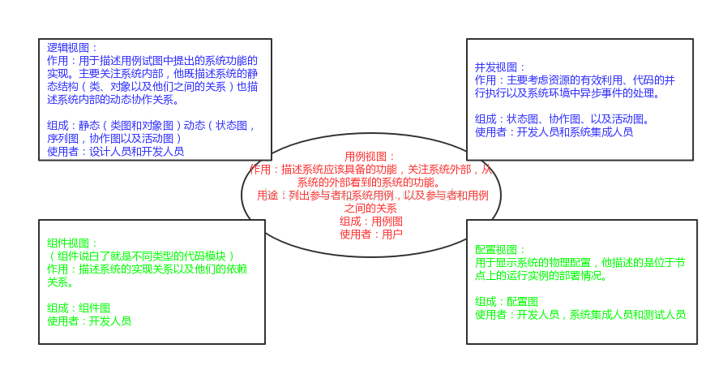
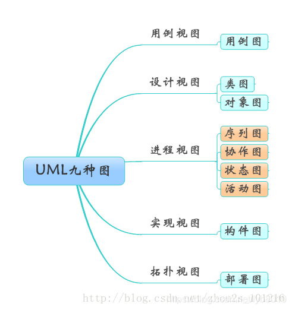

软件工程出现的直接原因，软件危机：  
软件开发进度难于预测；开发成本难以控制；功能难以满足用户期望；质量无法保证；难以维护；缺少适当的文档资料。

软件工程模型，也叫软件开发模型，是一种用来指导我们开发过程的进行方式的思想。

软件工程的定义，有多个广泛传播的版本。

软件工程过程包括4个方面：   
（1）P（Plan）——软件规格说明。  
（2）D(Do)——软件开发。  
（3）C(Check)——软件确认。  
（4）A(Action)——软件演进。  

软件过程模型/软件生命周期模型。  
常见的软件过程模型：  
（1）**瀑布模型**。  
（2）圆形话模型。  
（3）螺旋模型。  

**敏捷模型**。  
敏捷方法的特点：  
（1）适应性而非预设性。  软件开发与传统工程有着显著的不同：软件开发的环境是不可预测的、需求是不稳定的、理论基础是不坚实的，因此无法提前完美地计划——这要求软件开发方法具有较高的适应性。  
（2）面向人而非面向过程。管理人员在一定程度上已经脱离实际的开发活动，因此对开发活动的决策可能是脱离实际的、不受开发人员支持的，因此在软件开发过程中，开发人员和管理人员应该具有相同的地位，他们共同对整个开发过程负责。

敏捷方法的核心思想：  
（1）敏捷方法是适应型，而非可预测型。  
（2）敏捷方法是以人为本，而非以过程为本。  
（3）迭代增量式的开发过程。  

主要的敏捷方法：  
（1）极限编程。交流（加强交流）、朴素（从简单做起）、反馈（寻求反馈）和勇气（用于实事求是）。    
（2）水晶系列方法。  
（3）Scrum。  
（4）特征驱动开发方法。FDD定义了6种角色：项目经理、首席架构设计师、开发经理、主程序员、程序员和领域专家。FDD有5个核心过程：开发整体对象模型、构造特征列表、计划特征开发、特征设计和特征构建。

**统一过程模型**。  
RUP的生命周期。  

RUP的9个核心工作流：  
（1）业务建模。  
（2）需求。  
（3）分析与设计。  
（4）实现。  
（5）测试。  
（6）部署。  
（7）配置与变更管理。  
（8）项目管理。  
（9）环境。  

RUP把软件开发生命周期换分为多个循环，每个循环包含4个阶段：  
（1）初始阶段。  
（2）细化阶段。  
（3）构造阶段。  
（4）移交阶段。  
每个阶段结束前，有一个理成本评估该阶段的工作。

RUP中的核心概念：  
（1）角色。  
（2）活动。  
（3）制品。  
（4）工作流。  

RUP的特点：
（1）用例驱动。  
（2）以体系结构为中心。“4+1”视图模型中的视图：逻辑视图（用户）、实现视图（程序员）、进程视图（系统集成人员）、部署视图（系统工程师）、用例视图（分析人员和测试人员）。  
（3）迭代与增量。  

软件能力成熟度模型(CMM)。  
软件能力成熟度模型集成(CMMI)。软件能力成熟度的框架：  
（1）Level1初始级。  
（2）Level2已管理级。  
（3）Level3已定义级。  
（4）Level量化管理级。  
（5）Level5优化级。  

4+1视图是一种用来描述系统架构的良好工具。

4+1视图简介

UML中的4+1视图

[【软件架构】运用RUP 4+1视图软件架构设计(逻辑视图、实现视图、进程视图、物理视图和用例视图)](https://www.cnblogs.com/bandaoyu/p/16752636.html)

---
|视图名称|中文名|用途|表示方法|常用群体|开发阶段|
|-|-|-|-|-|-|
|user case view|场景视图|描述系统的行为|用例图、时序图|所有利益相关者（用户、产品经理、开发人员等）。用例图是所有利益相关者都能看懂的一种表达形式，便于大家交流软件设计开发的核心内容——需求|需求分析、测试阶段（验证功能）|
|logical view|逻辑视图|关注功能，不仅包括用户可见的功能，还包括为实现用户功能而必须提供的"辅助功能模块"；它们可能是逻辑层、功能模块等。|类图、对象图（相对类图可以体现更具体的业务逻辑）、包图、状态图|开发人员、系统分析师|架构设计阶段|
|process view|进程/过程/处理/构件视图|关注进程、线程、对象等运行时概念，以及相关的并发、同步、通信等问题。处理视图和开发视图的关系：开发视图一般偏重程序包在编译时期的静态依赖关系，而这些程序运行起来之后会表现为对象、线程、进程，处理视图比较关注的正是这些运行时单元的交互问题。|活动图、序列图|系统工程师、运维人员|架构设计阶段、测试阶段（性能测试）、部署与运维阶|
|implementation view|开发/实现视图|关注程序包，不仅包括要编写的源程序，还包括可以直接使用的第三方SDK和现成框架、类库，以及开发的系统将运行于其上的系统软件或中间件。开发视图和逻辑视图之间可能存在一定的映射关系：比如逻辑层一般会映射到多个程序包等。|组件图、包图|开发人员、架构师|架构设计阶段、开发实现阶段|
|deployment view|物理/部署视图|关注"目标程序及其依赖的运行库和系统软件"最终如何安装或部署到物理机器，以及如何部署机器和网络来配合软件系统的可靠性、可伸缩性等要求。物理视图和处理视图的关系：处理视图特别关注目标程序的动态执行情况，而物理视图重视目标程序的静态位置问题；物理视图是综合考虑软件系统和整个IT系统相互影响的架构视图。|部署图|运维人员、基础设施团队|架构设计阶段、部署与运维阶|