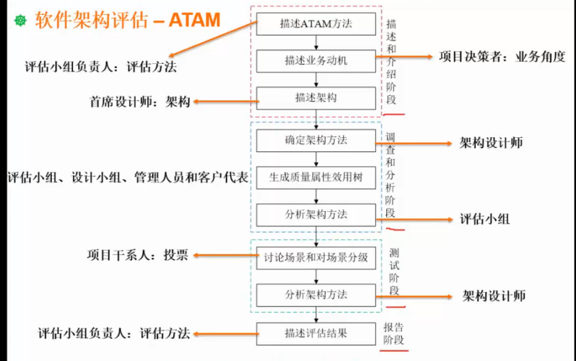

ATAM评估软件体系结构的工作，分为4个基本阶段：演示、调查和分析、测试、报告。这个戒烟划分更强调每个阶段的具体工作和产出，操作性比前面的更好。


图片出处[A06](https://www.bilibili.com/video/BV1SB4y157ND/?p=129&vd_source=a12bbd533d8c0e5e60f4e9a56e2e3938)

第一阶段：演示。这个阶段的主要任务是让所有参与者了解评估的方法和自己需要做的事情。

第1步，介绍ATAM。评估负责人向所有相关参与者提供与ATAM过程相关的一般信息；领导者说明评估中使用的分析技术以及评估的预期结果；领导者解决小组成员的任何疑虑、期望或者问题。

第2步，介业务驱动因素。系统功能；利益相关方（最终用户、结构式、应用开发人员）；业务目标；系统限制。

第3步，介绍要评估的体系结构。胡佛事件架构和银行事件架构（有啥用？）。

第二阶段：调查和分析

第4步，确定架构方法。事件架构（胡佛事件架构、银行事件架构是例子，实际使用的是我们自己设计的架构），提供了“事件”和应用程序的管理思路，从而让软件系统架构评估过程中，确保对事件及系统动作的分析是有序的。一般选择胡佛架构或者银行架构。

第5步，生成质量属性效用树。确定最重要的质量属性，以及这些属性的优先级——效用树是完成这一目标的有效方法。效用树的各个根节点如何获取:利益相关者->关心的场景->场景对应的质量属性。对场景对应的质量属性进行更细力度的分解，可以获得可操作性、针对性更强的质量属性效用树。

```  
性能
├─ 响应时间
│  ├─ 普通用户查询商品列表（并发≤500）：响应时间≤1.5秒  
│  └─ 管理员批量导出数据（数据量≥10万条）：响应时间≤5分钟  
├─ 吞吐量  
│  ├─ 促销活动期间（并发≤1万）：订单处理速率≥2000笔/秒  
│  └─ 峰值时段（持续2小时）：系统支持≥5万并发用户访问  
└─ 稳定性  
   ├─ 连续运行72小时：错误率≤0.1%  
   └─ 负载波动±20%：系统不崩溃、不内存泄漏  
```

效用树中的叶子节点（效用）的优先级分三级：高、中、低。

第6步：分析体系结构方法。  
分析的步骤：  
（1）调查架构方法。对架构的质量属性（可变性、可靠性、集成性、功能性可修改性）进行详细的分析，了解这些属性是否得到了满足。  
（2）创建分析问题。创建一个关于质量属性的问题清单（类似"xx模块可以xx吗？"）    
（3）分析问题的答案。通过讨论获得针对第（2）步问题的答案清单。  
（4）找出风险、非风险、敏感点和权衡点。  

第三阶段：测试。  
第7步，头脑风暴和优先场景。（可以基于质量属性效用树种的高分叶子结点）头脑风暴用于获取（利益相关者的）情景列表；基于利益相关者的投票，确定票数超过阈值的（重要的）情景。一般来说，我们会为每个情景确定其对应的质量属性、场景分类等信息，以便于管理。

质量属性效用树侧重“可以统计”；优先场景侧重“情景”、对利益相关者来说易于理解。二者不完全重复。

第8步：分析架构方法。  
步骤：  
（1）调查架构方法。在基于质量属性效用树的架构调查中，我们已经使用了一部分质量属性/情景，这里使用优先场景独有的质量属性。  
（2）创建分析问题。针对优先场景提出问题。  
（3）分析问题的答案。回答第（2）步的问题，了解相应质量属性需求是否得到满足。有些质量属性是非必需的，需要注意。  
（4）找出风险、非风险、敏感点和平衡点。  

第四阶段：报告ATAM  
提供内容：  
（1）质量属性效用树。  
（2）优先场景。  
（3）分析问题及其答案。  
（4）确定的风险和非风险。  
（5）确定的架构方法。就是架构本身。  