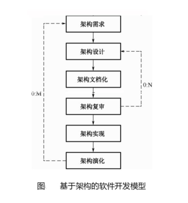

常用概念、术语：  
设计元素。系统、概念子系统、概念构件、实际构件。  
视角与视图。  
用例和质量场景。  

[基于架构的软件设计和软件开发模型](https://www.cnblogs.com/callbin/p/16665919.html)  
基于体系结构的开发模型的软件过程：  
（1）需求。用户对目标软件系统在功能、行为、性能、设计约束等方面的期望。*需求过程*：需求获取（质量目标、系统的商业目标、系统开发人员的商业目标），标识构件（），架构需求评审（组织一个有不同利益相关者代表构成的小组，对架构需求和构件进行审查）。如果需求库中有类似的系统架构需求，那么可以复用，从而降低成本（软件开发领域降低成本的重要方法）。  
（2）设计。  软件体系结构设计过程：提出软件体系结构模型；把已标识的构件映射到软件体系结构中；分析构件之间的相互作用；产生软件体系结构；设计评审。  
（3）文档化。体系结构规格说明数；测试体系结构需求的质量设计说明书。  
（4）复审。  
（5）实现。这里的实现不是开发代码，而是用实体显示一个软件体系结构。  
（6）演化。6个步骤：需求变化归类；制订体系结构演化计划；修改、增加或删除构件；更新构件的相互作用；构件组装与测试；技术评审。  

架构需求评审的内容：确认需求是否真实地反映了用户的要求；类的分组是否合理；构件合并是否合理等。

如何设计架构：
（1）提出软件架构模型。基于对需求的认识和设计开发经验，选择某个大概率合适的架构模型（分布式、微服务、分层、主从等等）。
（2）把已经标识的构件映射到软件架构中。基于需求标识出来的构件，需要一个个放在架构模型的合适位置，形成理论上可以运行的系统框架。
（3）分析构件之间的相互作用。确认构件的位置是正确的。
（4）产生软件架构。细化架构设计：补充关键构件之外的小模块（如必要的数据预处理）。
（5）设计评审。从多样（技能、利益）的角度评估架构的合理性。

